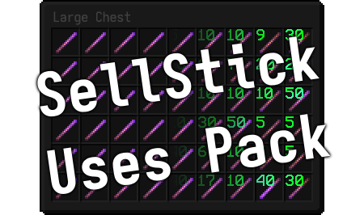

  

A resource pack that shows you how many uses your SellStick have without having to hover over them. Uses Custom Items feature from MCPatcher or Optifine. Made for the Cosmic Craft server, but can be adapted to other servers.

# Requirements
- MCPatcher or Optifine

# Installation
1. Download the pack from the [releases](https://github.com/aembur/sellstick-uses-pack/releases). The `P1`, `P3`, and `P6`  at the end of filenames stand for pack formats. See [here](https://minecraft.fandom.com/wiki/Pack_format) for the one you should download for your Minecraft version.
	- If your version isn't there, download any pack, then edit the `pack.mcmeta` file, and change `pack_format` to one corresponding with your Minecraft version. See [here](https://minecraft.fandom.com/wiki/Pack_format) for the value you should use.
2. Place the file in your `.minecraft/resourcepacks` folder.
3. In Minecraft, go to `Options > Resource Packs` and move the `SellStick Uses` pack to the **Selected Resource Packs**.
4. Make sure **Custom Items** are turned **ON** in `Options > Video Settings > Quality`.

# Generating your own pack
If you want to change the stick image, font and font colours, you can do so by changing the `stick.png` texture and adding your own fonts to the `resource` folder, then editing the `generate.py` to use your own fonts.
Afterwards, run `generate.py -p [pack format] -u [max uses]` to generate a pack.

# Making this work on other servers
This pack works by trying to match a regex pattern in the item lore. Making this pack work in other servers is as simple as changing the regex pattern in the `properties.template` file found in the `resource` folder.
